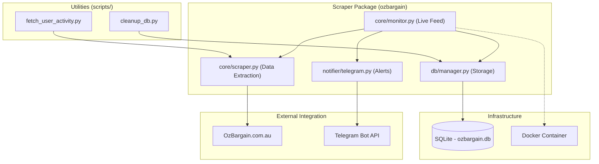

# OzBargain Monitor & Scraper

A robust Python-based toolkit for monitoring live deals on [OzBargain](https://www.ozbargain.com.au), tracking trend velocity, and automating user activity archiving.

## 🏗 Architecture

The system is organized into a modular Python package (`ozbargain`) designed for scalability and containerization.



### Key Components
* **`ozbargain.core.monitor`**: The heartbeat of the system. Watches the `/live` feed using Playwright, detects new events, and orchestrates scraping and alerting.
* **`ozbargain.core.scraper`**: Handles the heavy lifting of parsing OzBargain. Features include:
    * **Bot-Wall Resilience**: Specialized logic to handle Cloudflare security challenges.
    * **Metadata Fallback**: Uses live-row data when direct page scraping is restricted.
    * **Context Awareness**: Resolves comment links back to their parent deal nodes.
* **`ozbargain.db.manager`**: Centralized SQLite state management. Tracks snapshots for trending analytics and maintains the alert history.
* **`ozbargain.notifier.telegram`**: Dispatcher for real-time deal alerts.

---

## 🚀 Getting Started

### Prerequisites
* Python 3.10+
* Docker (Recommended for production)

### Environment Configuration
Create a `.env` file in the root:
```ini
TELEGRAM_BOT_TOKEN="your_bot_token"
TELEGRAM_CHAT_ID="your_chat_id"
MIN_HEAT_SCORE=60                # Threshold for trending alerts
TRENDING_CHECK_INTERVAL=30       # Minutes between velocity scans
POLL_INTERVAL=5                  # Seconds between feed polls
```

---

## 🐳 Docker Deployment (Recommended)

### Hybrid Bridge (Stealth Mode)
To bypass Cloudflare bot detection, use the `manage.sh` orchestrator. This runs a real Chrome instance on the host and connects via CDP.

```bash
# Start host browser and docker monitor
./manage.sh start
```

### Standard Deployment
Alternatively, build and run the container manually:
```bash
docker build -t ozbargain-scraper .

docker run -d \
    --name ozbargain-monitor \
    --env-file .env \
    -e TZ=Australia/Sydney \
    -v /etc/localtime:/etc/localtime:ro \
    -v $(pwd)/ozbargain.db:/app/ozbargain.db \
    ozbargain-scraper
```

### 3. Check Logs
```bash
docker logs -f ozbargain-monitor
```

---

## 🛠 Local Development

### Installation
1. Install dependencies:
   ```bash
   pip install -r requirements.txt
   playwright install chromium
   ```

2. Run the monitor (from the project root):
   ```bash
   export PYTHONPATH=$PYTHONPATH:.
   python3 -m ozbargain.core.monitor
   ```

---

## 🧹 Maintenance Scripts

Useful utilities located in the `scripts/` directory:

* **Fetch User Activity**: Scrape a specific user archive.
  ```bash
  python3 -m scripts.fetch_user_activity --username <name>
  ```
* **Cleanup Database**: Purge or fix inconsistent records.
  ```bash
  python3 -m scripts.cleanup_db
  ```

---

## 🛡 Security & Anti-Bot
OzBargain employs aggressive security verification (Cloudflare Turnstile). This scraper implements a **Hybrid Resolution** strategy: 
1. If a direct scrape is blocked, it resolves the event using metadata captured from the Live Feed row.
2. For comments, it automatically looks up the parent deal in the database to ensure data integrity.
