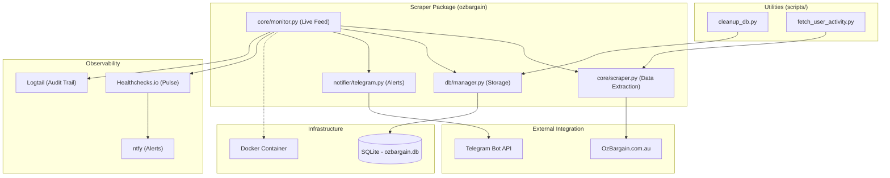

# OzBargain Monitor & Scraper

A robust Python-based toolkit for monitoring live deals on [OzBargain](https://www.ozbargain.com.au), tracking trend velocity, and automating user activity archiving.

## 🏗 Architecture

The system is organized into a modular Python package (`ozbargain`) designed for scalability and containerization.


```mermaid
graph TD
    subgraph "Scraper Package (ozbargain)"
        M["core/monitor.py (Live Feed)"] --> S["core/scraper.py (Data Extraction)"]
        M --> DB["db/manager.py (Storage)"]
        M --> T["notifier/telegram.py (Alerts)"]
    end

    subgraph "Infrastructure"
        DB --> SL[(SQLite - ozbargain.db)]
        M -.-> Docker[Docker Container]
    end
    subgraph "External Integration"
        S --> OZ["OzBargain.com.au"]
        T --> TG["Telegram Bot API"]
    end

    subgraph "Observability"
        M --> HC["Healthchecks.io (Pulse)"]
        M --> LT["Logtail (Audit Trail)"]
        HC --> NT["ntfy (Alerts)"]
    end

    subgraph "Utilities (scripts/)"
        CU["cleanup_db.py"] --> DB
        FU["fetch_user_activity.py"] --> S
    end
```

### Key Components
* **`ozbargain.core.monitor`**: The heartbeat of the system. Watches the `/live` feed, detects new events, and orchestrates scraping and alerting.
    * **Smart Cooldown**: Consolidates re-scrapes by Node ID and Deal Title. Prevents redundant scrapes when multiple comments or votes arrive for the same deal within a 2-minute window.
    * **Timeout Optimization**: Uses a aggressive 15-second timeout for individual deal scrapes, ensuring the live feed remains responsive even during OzBargain slowness or bot-wall challenges.
    * **Native CDP Support**: Connects directly to a host Chrome instance via Chrome DevTools Protocol (CDP) for high performance and better bot-wall resilience.
    * **Stale Session Detection**: Automatically detects when the `/live` feed becomes unresponsive or empty for more than 10 minutes and forces a session restart.
    * **Periodic Session Refresh**: Automatically refreshes the browser environment every 4 hours to prevent memory leaks and maintain long-term stability.

    * **Real-Time Score Tracking**: Processes individual `Vote Up` and `New comment` events from the live feed to trigger re-scrapes.
    * **Scrape Rate Limiting**: Employs a smart 2-minute cooldown per URL to avoid Cloudflare bot-wall blocks.

* **`ozbargain.core.scraper`**: Handles the heavy lifting of parsing OzBargain. Features include:
    * **Bot-Wall Resilience**: Specialized logic to handle Cloudflare security challenges.
    * **Metadata Fallback**: Uses live-row data when direct page scraping is restricted.
    * **Context Awareness**: Resolves comment links back to their parent deal nodes.
* **`ozbargain.db.manager`**: Centralized SQLite state management. Features a **Data Integrity Guard** to prevent Cloudflare blocks from overwriting high popularity scores with zeros. Tracks snapshots for trending analytics and maintains the alert history.
* **`ozbargain.notifier.telegram`**: Dispatcher for real-time deal alerts.
* **`ozbargain.utils.logger`**: Professional dual-sink logging utility. 
    * **Human Sink**: Formatted stdout for terminal debugging.
    * **Machine Sink**: JSON-lines in `logs/monitor.log` for programmatic analysis.
    * **Remote Sink**: Real-time structured log streaming to Logtail.
* **`Health Monitoring`**: Integrated dead-man's switch via Healthchecks.io. Sends a non-blocking pulse after every successful poll cycle to detect hung processes.

---

## 🤖 OzBargain Data Agent
The project includes an AI "Data Agent" skill located at `.agents/skills/ozbargain_data_agent.md`. You can ask this AI agent to:
* **"Give me a health check"**: Returns a report on deals tracked, alerts sent, active/expired ratios, and Data Integrity Guard hits.
* **"Why didn't node/12345 alert?"**: Audits a specific deal, checking its heat score, expiry status, and snapshot trajectory against business rules.
* **"What are the top trending deals?"**: Lists the hottest active deals currently in the database.

---

## 🚀 Getting Started

### Prerequisites
* Python 3.10+
* Docker (Recommended for production)

### Environment Configuration
Create a `.env` file in the root:
```ini
TELEGRAM_BOT_TOKEN="your_bot_token"
TELEGRAM_CHAT_ID="your_chat_id"
MIN_HEAT_SCORE=60                # Threshold for trending alerts
TRENDING_CHECK_INTERVAL=30       # Minutes between velocity scans
POLL_INTERVAL=5                  # Seconds between feed polls

# Observability
LOGTAIL_TOKEN="your_token"       # Optional: Stream logs to Logtail
HEALTHCHECK_PING_URL="https://hc-ping.com/uuid" # Optional: Pulse heartbeat
```

---

## 🐳 Docker Deployment (Recommended)

### Hybrid Bridge (Stealth Mode)
To bypass Cloudflare bot detection, use the `manage.sh` orchestrator. This runs a real Chrome instance on the host and the monitor connects via CDP automatically. Includes **Smart Cooldown** to consolidate scrapes and minimize detection.


```bash
# Start host browser and docker monitor
make start
```

### Standard Deployment
Alternatively, you can run the container manually via docker compose:
```bash
# Ensure CHROME_CDP_URL is set in your .env or exported if using CDP
docker compose up -d --build
```

### 3. Check Logs
```bash
make logs
```

---

## 🛠 Local Development

### Installation
1. Install dependencies using `uv` (deterministic builds):
   ```bash
   uv pip sync requirements.lock
   uv run playwright install chromium
   ```

2. Run the monitor (from the project root):
   ```bash
   export PYTHONPATH=$PYTHONPATH:.
   python3 -m ozbargain.core.monitor
   ```

### Running Tests
We use `pytest` for validating core logic (e.g., Data Integrity Guard and HTML parsing). Run the suite via the Makefile:
```bash
make test
```

---

## 🧹 Maintenance Scripts

Useful utilities located in the `scripts/` directory:

* **Fetch User Activity**: Scrape a specific user archive.
  ```bash
  python3 -m scripts.fetch_user_activity --username <name>
  ```
* **Cleanup Database**: Purge or fix inconsistent records.
  ```bash
  python3 -m scripts.cleanup_db
  ```

---

## 🛡 Security & Anti-Bot
OzBargain employs aggressive security verification (Cloudflare Turnstile). This scraper implements a **Hybrid Resolution** strategy: 
1. If a direct scrape is blocked, it resolves the event using metadata captured from the Live Feed row.
2. For comments, it automatically looks up the parent deal in the database to ensure data integrity.

### CDP Security (Priority 1)
When running the `manage.sh` Hybrid Bridge mode, the host Google Chrome instance exposes its Remote Debugging Port via CDP. To prevent local network Remote Code Execution (RCE) vulnerabilities, the script explicitly binds the CDP socket to the `127.0.0.1` loopback interface. The Python container securely communicates with the host over this isolated loopback using Docker's `host` networking.
